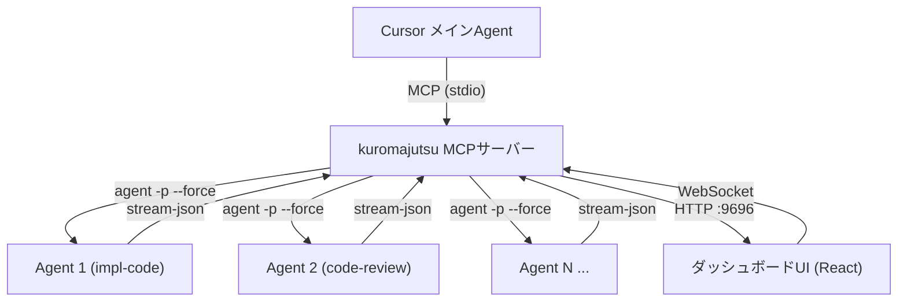
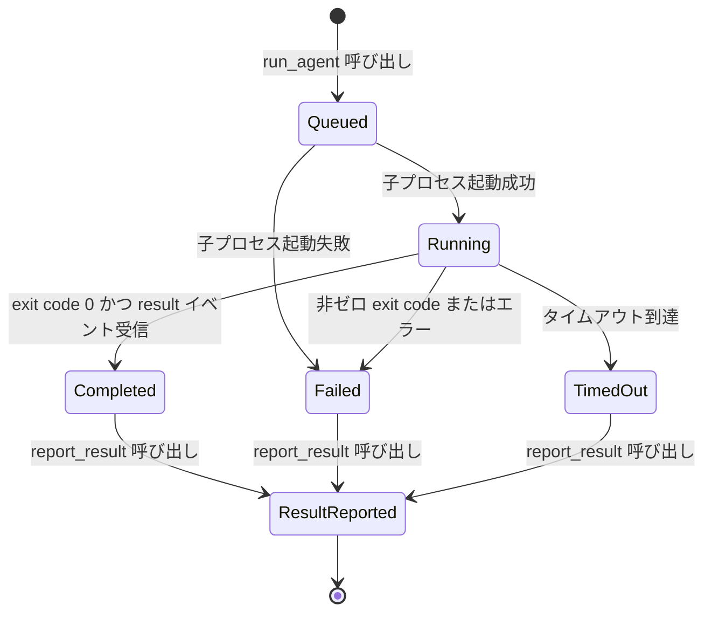
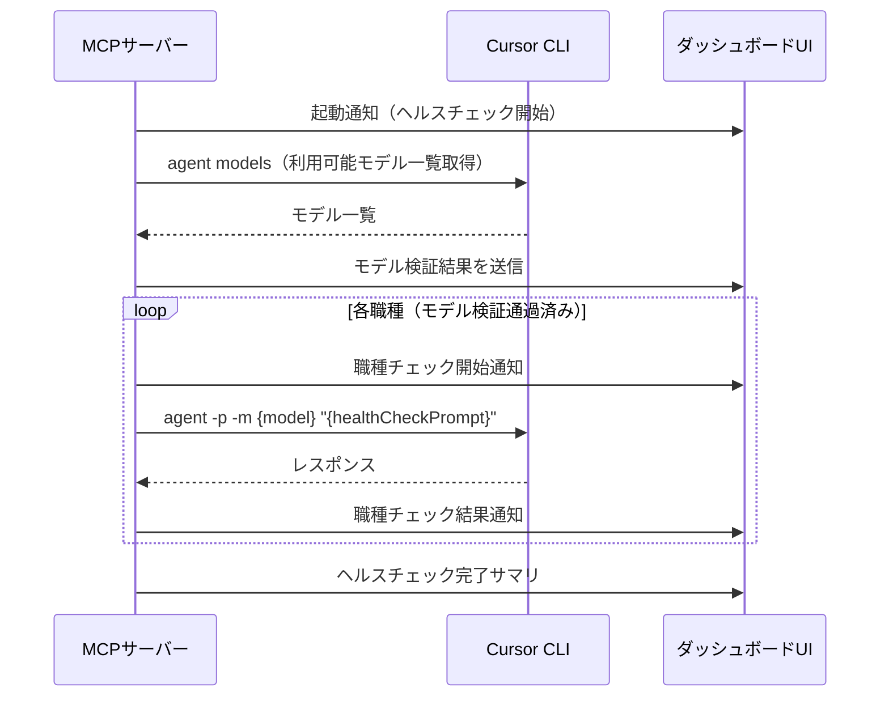

# Kuromajutsu 仕様書

> Cursor Agent 並列実行管理システム

## 1. システム概要

### 1.1 目的

Kuromajutsu は、Cursor の MCP（Model Context Protocol）サーバーとして動作し、メインの Cursor Agent から複数のサブ Agent を並列に起動・管理するためのシステムである。各 Agent は「職種（Role）」として定義された役割に基づいて動作し、コード実装、レビュー、テスト作成などのタスクを並行して処理できる。

Agent の実行は必ず「グループ（Group）」に所属させる。グループは関連するタスク群をまとめる単位であり、MCP ツール経由で事前に作成する。グループには目的の簡潔な説明を登録し、一意の ID が発番される。これにより、ダッシュボード UI 上で Agent をグループ単位で整理・表示でき、タスクの見通しが向上する。

### 1.2 全体アーキテクチャ



### 1.3 技術スタック

| コンポーネント | 技術 |
|---|---|
| MCPサーバー | TypeScript + Node.js（`@modelcontextprotocol/sdk`、stdio トランスポート） |
| ダッシュボードUI | React（MCPサーバーが内蔵HTTPサーバーでホスティング） |
| リアルタイム通信 | WebSocket（UI ⇔ MCPサーバー間） |
| Agent実行 | Cursor CLI ヘッドレスモード |
| 設定管理 | YAML（`kuromajutsu.config.yaml`） |
| コンテナ実行環境 | Docker / Docker Compose |

### 1.3.1 Docker 実行環境

開発・テスト・ビルドは Docker コンテナ内で実行する。ホスト環境に Node.js のインストールは不要。

**起動コマンド:**

```bash
# 開発モード（ホットリロード付き）
docker compose up

# ビルド
docker compose run --rm app npm run build

# テスト
docker compose run --rm app npm test
```

**ポートマッピング:**
- `9696:9696` — ダッシュボード UI

**ボリューム:**
- プロジェクトルートをコンテナにマウント（ホットリロード対応）
- `node_modules` はコンテナ内に隔離

### 1.4 動作原理

1. Cursor のメイン Agent が MCP ツール `create_group` でグループを作成する
2. メイン Agent が `run_agent` にグループ ID を指定して Agent を起動する
3. MCPサーバーが Cursor CLI をヘッドレスモード（`agent -p --force`）で子プロセスとして起動する
4. 子プロセスの出力を `--output-format stream-json --stream-partial-output` でリアルタイムにパースし、進捗を追跡する
5. メイン Agent は `wait_agent` で完了を待機し、`report_result` で結果を収集する
6. 用が済んだら `delete_group` でグループを削除する
7. ダッシュボード UI は WebSocket 経由でリアルタイムにすべての Agent の状態をグループ単位で表示する

---

## 2. MCPサーバー

### 2.1 トランスポート

- Cursor との通信: **stdio**（標準入出力）
- ダッシュボード UI 配信: **HTTP**（ポート `9696`「くろくろ」）
- UI リアルタイム更新: **WebSocket**（同ポート）

### 2.2 提供ツール一覧

MCPサーバーは以下の **8つのツール** を提供する。

#### 2.2.1 `create_group` — グループを作成する

関連する Agent 群をまとめるグループを作成し、一意の ID を発番して返す。Agent を実行する前に、必ずグループを作成する必要がある。

**入力パラメータ:**

| パラメータ | 型 | 必須 | 説明 |
|---|---|---|---|
| `description` | `string` | はい | グループの目的の簡潔な説明（例: 「認証機能の実装・テスト・レビュー」） |

**返却値:**

```json
{
  "groupId": "grp-1739487600-b4e1",
  "description": "認証機能の実装・テスト・レビュー",
  "createdAt": "2026-02-13T12:00:00.000Z",
  "status": "active"
}
```

**内部動作:**
1. ID を `grp-{unixTimestamp}-{random4hex}` 形式で発番する
2. グループを管理テーブル（インメモリ Map）に登録する
3. WebSocket 経由でダッシュボード UI に通知する

#### 2.2.2 `delete_group` — グループを削除する

指定したグループを削除する。グループに所属する Agent がすべて完了済み（または未登録）であることが条件。実行中の Agent が存在する場合はエラーを返す。

**入力パラメータ:**

| パラメータ | 型 | 必須 | 説明 |
|---|---|---|---|
| `groupId` | `string` | はい | 削除対象のグループ ID |

**返却値:**

```json
{
  "deleted": true,
  "groupId": "grp-1739487600-b4e1"
}
```

**内部動作:**
1. グループの存在を検証する
2. グループに所属する実行中の Agent がないことを確認する（実行中の Agent がある場合はエラー）
3. グループを管理テーブルから削除する
4. WebSocket 経由でダッシュボード UI に通知する

#### 2.2.3 `run_agent` — Agent を実行する

指定した職種とプロンプトで新しい Agent を起動し、一意の ID を発番して返す。Agent は必ずグループに所属させる。

**入力パラメータ:**

| パラメータ | 型 | 必須 | 説明 |
|---|---|---|---|
| `groupId` | `string` | はい | 所属するグループ ID（`create_group` で事前に作成） |
| `role` | `string` | はい | 職種 ID（例: `impl-code`） |
| `prompt` | `string` | はい | Agent に渡すユーザープロンプト |
| `workingDirectory` | `string` | いいえ | 作業ディレクトリ（デフォルト: カレントディレクトリ） |
| `timeout_ms` | `number` | いいえ | タイムアウト（ミリ秒）。デフォルトは設定ファイルの値 |

**モデルの決定:** `run_agent` はモデルパラメータを受け付けない。使用するモデルは職種（Role）の設定に従う。

**返却値:**

```json
{
  "agentId": "impl-code-1739487600-a3f2",
  "groupId": "grp-1739487600-b4e1",
  "role": "impl-code",
  "model": "claude-4-sonnet",
  "status": "queued"
}
```

**内部動作:**
1. 指定された `groupId` が存在し、アクティブであることを検証する
2. 指定された `role` が存在し、利用可能（ヘルスチェック通過済み）か検証する
3. ID を `{role}-{timestamp}-{random4}` 形式で発番する
4. Agent をグループに紐付けて管理テーブルに登録する
5. Cursor CLI を以下のコマンドで起動する:
   ```bash
   agent -p --force -m {role.model} --output-format stream-json --stream-partial-output "{role.systemPrompt}\n\n{prompt}"
   ```
6. 子プロセスの stream-json 出力をリアルタイムでパースし、内部状態を更新する
7. WebSocket 経由でダッシュボード UI に通知する

#### 2.2.4 `list_agents` — 実行中の Agent 一覧を取得する

現在管理しているすべての Agent（実行中・完了済み含む）の一覧を返す。グループ ID を指定して、特定グループに所属する Agent のみをフィルタリングできる。

**入力パラメータ:**

| パラメータ | 型 | 必須 | 説明 |
|---|---|---|---|
| `groupId` | `string` | いいえ | フィルタ: 指定したグループに所属する Agent のみ取得 |
| `status` | `string` | いいえ | フィルタ: `running`, `completed`, `failed`, `all`（デフォルト: `all`） |

**返却値:**

```json
{
  "agents": [
    {
      "agentId": "impl-code-1739487600-a3f2",
      "groupId": "grp-1739487600-b4e1",
      "role": "impl-code",
      "model": "claude-4-sonnet",
      "status": "running",
      "startedAt": "2026-02-13T12:00:00.000Z",
      "elapsed_ms": 15000,
      "toolCallCount": 3
    }
  ],
  "total": 1
}
```

#### 2.2.5 `get_agent_status` — Agent の詳細状況を取得する

指定した ID の Agent のリアルタイム詳細情報を返す。

**入力パラメータ:**

| パラメータ | 型 | 必須 | 説明 |
|---|---|---|---|
| `agentId` | `string` | はい | Agent ID |

**返却値:**

```json
{
  "agentId": "impl-code-1739487600-a3f2",
  "groupId": "grp-1739487600-b4e1",
  "role": "impl-code",
  "model": "claude-4-sonnet",
  "status": "running",
  "startedAt": "2026-02-13T12:00:00.000Z",
  "elapsed_ms": 15000,
  "toolCallCount": 5,
  "lastAssistantMessage": "ファイルを読み込んで実装を開始します...",
  "recentToolCalls": [
    {
      "callId": "toolu_vrtx_01abc",
      "type": "readToolCall",
      "subtype": "completed",
      "args": { "path": "src/index.ts" }
    }
  ],
  "result": null
}
```

#### 2.2.6 `wait_agent` — Agent の完了を待機する

指定した Agent（複数可）が完了するまでブロックする。

**入力パラメータ:**

| パラメータ | 型 | 必須 | 説明 |
|---|---|---|---|
| `agentIds` | `string[]` | はい | 待機対象の Agent ID の配列 |
| `timeout_ms` | `number` | いいえ | 全体のタイムアウト（ミリ秒）。デフォルト: 無制限 |
| `mode` | `string` | いいえ | `all`（全て完了で返却）または `any`（いずれか完了で返却）。デフォルト: `all` |

**返却値:**

```json
{
  "completed": [
    {
      "agentId": "impl-code-1739487600-a3f2",
      "status": "completed",
      "duration_ms": 45000
    }
  ],
  "pending": [],
  "timedOut": false
}
```

#### 2.2.7 `report_result` — Agent の実行結果を登録する

Agent の実行完了後に、結果データを登録する。このツールは Agent 自身がプロンプト内の指示に従い MCP 経由で呼び出す想定。成功・失敗いずれの場合でも登録できる。

**入力パラメータ:**

| パラメータ | 型 | 必須 | 説明 |
|---|---|---|---|
| `agentId` | `string` | はい | Agent ID |
| `status` | `string` | はい | `success`, `failure`, `timeout`, `cancelled` のいずれか |
| `summary` | `string` | はい | 端的なテキストサマリ |
| `editedFiles` | `string[]` | いいえ | 編集したファイルパス一覧 |
| `createdFiles` | `string[]` | いいえ | 新規作成したファイルパス一覧 |
| `errorMessage` | `string` | いいえ | 失敗時のエラーメッセージ |

**自動付与されるフィールド（サーバー側で計算）:**

| フィールド | 型 | 説明 |
|---|---|---|
| `groupId` | `string` | 所属グループ ID |
| `duration_ms` | `number` | 実行所要時間（ミリ秒、開始〜現在の差分） |
| `model` | `string` | 使用モデル（職種設定から） |
| `role` | `string` | 職種 ID |
| `toolCallCount` | `number` | stream-json から計測したツール呼び出し回数 |
| `timestamp` | `string` | 完了時刻（ISO 8601） |

**返却値:**

```json
{
  "registered": true,
  "agentId": "impl-code-1739487600-a3f2"
}
```

#### 2.2.8 `list_roles` — 利用可能な職種一覧を返す

設定されている全職種の一覧と、それぞれの利用可否ステータスを返す。

**入力パラメータ:** なし

**返却値:**

```json
{
  "roles": [
    {
      "id": "impl-code",
      "name": "コード実装者",
      "model": "claude-4-sonnet",
      "available": true,
      "healthCheck": {
        "status": "passed",
        "checkedAt": "2026-02-13T12:00:00.000Z",
        "responseTime_ms": 1200
      },
      "modelValidation": {
        "status": "valid",
        "checkedAt": "2026-02-13T12:00:00.000Z"
      }
    },
    {
      "id": "code-review",
      "name": "コードレビュワー",
      "model": "invalid-model-name",
      "available": false,
      "healthCheck": {
        "status": "skipped",
        "reason": "モデル検証に失敗したためスキップ"
      },
      "modelValidation": {
        "status": "invalid",
        "message": "モデル 'invalid-model-name' は利用できません",
        "availableModels": ["claude-4-sonnet", "claude-4-opus", "gpt-4o"]
      }
    }
  ]
}
```

---

## 3. グループ（Group）定義

### 3.1 概要

グループは、関連する Agent の実行をまとめる論理的な単位である。メインの Cursor Agent が MCP ツール `create_group` で作成し、Agent 実行時に `groupId` を指定して紐付ける。

グループの用途:
- **タスク管理:** 関連する複数の Agent（実装・テスト・レビュー等）を1つのグループにまとめて管理する
- **UI 整理:** ダッシュボード UI 上で Agent をグループ単位で整理・表示し、タスクの見通しを向上させる
- **ライフサイクル管理:** グループ内の全 Agent が完了した後、グループを削除して整理できる

### 3.2 グループのデータ構造

```typescript
interface GroupDefinition {
  /** 一意識別子（`grp-{unixTimestamp}-{random4hex}` 形式） */
  id: string;
  /** グループの目的の簡潔な説明 */
  description: string;
  /** グループのステータス */
  status: "active" | "deleted";
  /** 作成日時（ISO 8601） */
  createdAt: string;
  /** 所属する Agent ID の一覧 */
  agentIds: string[];
}
```

### 3.3 ID 発番ルール

- 形式: `grp-{unixTimestamp}-{random4hex}`
- 例: `grp-1739487600-b4e1`
- グループ管理テーブル（インメモリ Map）のキーとして使用する

### 3.4 グループの管理

- グループはインメモリの Map で管理する（Agent 管理テーブルと同様）
- `create_group` で作成、`delete_group` で削除する
- Agent 実行時（`run_agent`）に `groupId` を指定して紐付ける
- グループに所属する実行中の Agent がある場合、そのグループは削除できない
- ダッシュボード UI からグループ一覧を確認できる

---

## 4. Agent 職種（Role）定義

### 4.1 職種のデータ構造

```typescript
interface RoleDefinition {
  /** 一意識別子 */
  id: string;
  /** 表示名 */
  name: string;
  /** Agent に渡すシステムプロンプト */
  systemPrompt: string;
  /** 使用する LLM モデル名（Cursor CLI の -m オプションに渡す値） */
  model: string;
  /** 使用可能なツールセット（将来の拡張用） */
  tools?: string[];
  /** ヘルスチェック時に使用する簡易テストプロンプト */
  healthCheckPrompt: string;
}
```

### 4.2 初期職種一覧

#### `impl-code` — コード実装者

| プロパティ | 値 |
|---|---|
| id | `impl-code` |
| name | コード実装者 |
| model | `claude-4-sonnet`（デフォルト） |
| systemPrompt | あなたはコード実装の専門家です。与えられた仕様や指示に基づき、高品質なコードを実装してください。実装が完了したら、必ず kuromajutsu MCP の `report_result` ツールを呼び出して結果を報告してください。 |
| healthCheckPrompt | `Hello, respond with exactly: OK` |

#### `code-review` — コードレビュワー

| プロパティ | 値 |
|---|---|
| id | `code-review` |
| name | コードレビュワー |
| model | `claude-4-sonnet`（デフォルト） |
| systemPrompt | あなたはコードレビューの専門家です。与えられたコードを精査し、品質・可読性・セキュリティ・パフォーマンスの観点からフィードバックを提供してください。レビューが完了したら、必ず kuromajutsu MCP の `report_result` ツールを呼び出して結果を報告してください。 |
| healthCheckPrompt | `Hello, respond with exactly: OK` |

#### `text-review` — 文章レビュワー

| プロパティ | 値 |
|---|---|
| id | `text-review` |
| name | 文章レビュワー |
| model | `claude-4-sonnet`（デフォルト） |
| systemPrompt | あなたは文章レビューの専門家です。与えられたテキストの文法、表現、構成、一貫性を確認し、改善提案を提供してください。レビューが完了したら、必ず kuromajutsu MCP の `report_result` ツールを呼び出して結果を報告してください。 |
| healthCheckPrompt | `Hello, respond with exactly: OK` |

#### `impl-test` — テスト実装者

| プロパティ | 値 |
|---|---|
| id | `impl-test` |
| name | テスト実装者 |
| model | `claude-4-sonnet`（デフォルト） |
| systemPrompt | あなたはテスト実装の専門家です。与えられた仕様やコードに対して、包括的なテストを作成してください。ユニットテスト、エッジケース、異常系のテストを含めてください。実装が完了したら、必ず kuromajutsu MCP の `report_result` ツールを呼び出して結果を報告してください。 |
| healthCheckPrompt | `Hello, respond with exactly: OK` |

### 4.3 職種の管理

- 職種の定義は設定ファイル `kuromajutsu.config.yaml` で管理する
- ダッシュボード UI からモデル・プロンプトをインラインで編集可能とする
- UI から変更した場合、設定ファイルにも反映する
- 将来的にカスタム職種の追加に対応する

---

## 5. Agent 実行ライフサイクル

### 5.1 状態遷移



### 5.2 ID 発番ルール

- 形式: `{role}-{unixTimestamp}-{random4hex}`
- 例: `impl-code-1739487600-a3f2`
- Agent 管理テーブル（インメモリ Map）のキーとして使用する

### 5.3 Cursor CLI 起動コマンド

```bash
agent -p --force \
  -m "{role.model}" \
  --output-format stream-json \
  --stream-partial-output \
  "{role.systemPrompt}\n\n{userPrompt}"
```

- `--force`: 確認なしでファイル変更を許可
- `-m`: 職種に設定されたモデルを指定
- `--output-format stream-json`: NDJSON 形式でイベントをストリーム出力
- `--stream-partial-output`: 文字単位のリアルタイム差分を有効化

### 5.4 stream-json パース

Cursor CLI が出力する NDJSON の各イベントタイプをパースして Agent の状態を更新する:

| イベント type | 処理 |
|---|---|
| `system` (subtype: `init`) | Agent の初期化完了を記録。使用モデルを確認 |
| `user` | ユーザープロンプトの送信を記録 |
| `assistant` | 最新のアシスタントメッセージを保持 |
| `tool_call` (subtype: `started`) | ツール呼び出しカウントをインクリメント。呼び出し中のツール情報を記録 |
| `tool_call` (subtype: `completed`) | ツール実行結果を記録。writeToolCall の場合はファイル一覧を更新 |
| `result` | Agent 実行完了。duration_ms と最終テキストを記録。ステータスを更新 |

### 5.5 タイムアウト処理

- `run_agent` 呼び出し時に `timeout_ms` を指定可能
- 指定なしの場合は設定ファイルの `defaultTimeout_ms` を使用
- タイムアウト到達時に子プロセスを SIGTERM で終了し、ステータスを `TimedOut` に更新

---

## 6. 結果データ構造

### 6.1 AgentResult インターフェース

```typescript
interface AgentResult {
  /** Agent ID */
  agentId: string;
  /** 所属グループ ID */
  groupId: string;
  /** 実行ステータス */
  status: "success" | "failure" | "timeout" | "cancelled";
  /** 端的なテキストサマリ */
  summary: string;
  /** 編集したファイルパス一覧 */
  editedFiles: string[];
  /** 新規作成したファイルパス一覧 */
  createdFiles: string[];
  /** 実行所要時間（ミリ秒） */
  duration_ms: number;
  /** 使用モデル */
  model: string;
  /** 職種 ID */
  role: string;
  /** ツール呼び出し回数 */
  toolCallCount: number;
  /** 失敗時のエラーメッセージ */
  errorMessage?: string;
  /** 生の Agent 出力テキスト（オプション） */
  rawOutput?: string;
  /** 完了時刻（ISO 8601） */
  timestamp: string;
}
```

### 6.2 結果の収集方法

1. **自動収集（stream-json パース由来）:** Agent の子プロセスが出力する stream-json から、`tool_call` イベント（writeToolCall）を解析し、`editedFiles` / `createdFiles` を自動的に収集する。`result` イベントから `duration_ms` を取得する。

2. **Agent 自身による報告（`report_result` ツール）:** Agent のシステムプロンプトに「完了後は `report_result` を呼び出すこと」と指示しておく。Agent が MCP ツール `report_result` を呼び出すことで、`summary` や `status` などの情報を登録する。

3. **結合:** サーバー側は自動収集したデータと Agent の自己報告データをマージして最終的な `AgentResult` を構築する。

### 6.3 失敗ケースの取り扱い

| 失敗パターン | status | 処理 |
|---|---|---|
| Agent が正常に report_result を呼んだが失敗を報告 | `failure` | Agent の報告をそのまま記録 |
| 子プロセスが非ゼロ終了コードで異常終了 | `failure` | stderr の内容を `errorMessage` に記録 |
| タイムアウトで強制終了 | `timeout` | それまでに収集した情報で結果を構築 |
| report_result が呼ばれなかった場合 | 自動判定 | exit code と result イベントから status を判定。summary は最終アシスタントメッセージを使用 |

---

## 7. ヘルスチェック・モデル検証

### 7.1 実行タイミング

MCPサーバー起動時に以下の順序で **自動実行** する。MCP ツールとしては提供しない。



### 7.2 モデル検証

1. MCPサーバー起動時に `agent models` コマンドを実行し、Cursor で利用可能なモデル一覧を取得する
2. 各職種に設定されたモデルが一覧に存在するか照合する
3. 利用不可のモデルが設定されている場合:
   - コンソールに警告ログを出力する
   - ダッシュボード UI に該当職種のエラーを表示する（赤色バッジ + 利用可能モデルへの変更を促す UI）
   - 該当職種での Agent 実行をブロックする（`run_agent` でエラーを返す）

### 7.3 ヘルスチェック

1. モデル検証を通過した職種に対して、`healthCheckPrompt` を Cursor CLI で実行する
   ```bash
   agent -p -m "{role.model}" "{role.healthCheckPrompt}"
   ```
2. 正常にレスポンスが返ればチェック通過とする
3. 結果をコンソールと UI にリアルタイムでレポートする（成功/失敗、応答時間）
4. すべてのチェック完了後にサマリを出力する

### 7.4 ヘルスチェック結果の構造

```typescript
interface HealthCheckResult {
  /** チェック対象の職種 ID */
  roleId: string;
  /** モデル検証結果 */
  modelValidation: {
    status: "valid" | "invalid";
    message?: string;
    checkedAt: string;
  };
  /** ヘルスチェック結果 */
  healthCheck: {
    status: "passed" | "failed" | "skipped";
    reason?: string;
    responseTime_ms?: number;
    checkedAt?: string;
  };
  /** この職種が利用可能かどうか */
  available: boolean;
}
```

---

## 8. ダッシュボード UI

### 8.1 概要

- MCPサーバーが内蔵 HTTP サーバーで配信する（デフォルトポート: `9696`「くろくろ」）
- React で構築する SPA（Single Page Application）
- WebSocket でサーバーとリアルタイム双方向通信する
- ダークテーマベースの魔術的なデザイン

### 8.2 画面構成

#### 8.2.1 ダッシュボード（メイン画面）

実行中の Agent 一覧をグループ単位でカード形式で表示する。

**グループ表示:**
- グループはアコーディオン/セクション形式で表示する
- 各グループのヘッダーにはグループ ID、説明、所属 Agent 数、全体の進捗状況を表示する
- グループ内の Agent カードはグリッドまたはリスト形式で並べる
- グループに所属しない Agent は「未分類」セクションに表示する（通常は存在しない）

**Agent カード表示内容:**
- Agent ID
- 職種名・アイコン
- 使用モデル
- 実行ステータス
- 経過時間（ライブカウントアップ）
- ツール呼び出し回数（リアルタイムカウンター）
- 最新のアシスタントメッセージ（トランケート表示）

**ステータス色分け:**

| ステータス | 色 | 視覚効果 |
|---|---|---|
| `queued` | グレー | 点滅（待機中） |
| `running` | 青 | パルスアニメーション（実行中） |
| `completed` / `success` | 緑 | フェードイン完了表示 |
| `failed` | 赤 | シェイクアニメーション → 静止 |
| `timeout` | 黄/オレンジ | 警告アイコン点滅 |
| `resultReported` | 緑（濃） | チェックマーク表示 |

#### 8.2.2 職種管理画面

使用可能な職種一覧を表示し、設定をインライン編集できる。

**表示・編集項目:**
- 職種 ID（読み取り専用）
- 表示名
- モデル（ドロップダウン: 利用可能モデル一覧から選択）
- システムプロンプト（テキストエリア編集）
- ヘルスチェックプロンプト
- 利用可否ステータス

**操作:**
- モデル変更時にリアルタイムでモデル検証を再実行する
- 変更を保存すると `kuromajutsu.config.yaml` に反映する

#### 8.2.3 実行履歴画面

過去の Agent 実行結果一覧を表示する。

**表示項目:**
- Agent ID
- グループ ID・説明
- 職種
- ステータス
- サマリ
- 所要時間
- 編集/作成ファイル一覧
- ツール呼び出し回数
- 実行日時

**機能:**
- グループ、ステータス、職種でのフィルタリング
- グループ単位でのグルーピング表示
- 時系列ソート

#### 8.2.4 ヘルスチェック状況画面

起動時のヘルスチェック進行状況をリアルタイムで表示する。

**進行ステップの表示:**

```
[1/3] モデル検証中...
  ├─ impl-code (claude-4-sonnet)    ✅ 有効
  ├─ code-review (claude-4-sonnet)  ✅ 有効
  ├─ text-review (claude-4-sonnet)  ✅ 有効
  └─ impl-test (claude-4-sonnet)    ✅ 有効

[2/3] ヘルスチェック実行中...
  ├─ impl-code     🔄 チェック中... (1.2s)
  ├─ code-review   ✅ OK (0.8s)
  ├─ text-review   ⏳ 待機中
  └─ impl-test     ⏳ 待機中

[3/3] 完了
  全 4 職種中 4 職種が利用可能です
```

**UI表現:**
- チェック中の職種カード: スピナーアニメーション表示
- チェック完了（成功）: 緑チェックアイコンに切替
- チェック完了（失敗）: 赤バツアイコンに切替
- モデル検証エラー: 警告バッジ + 利用可能モデルの提案表示

### 8.3 WebSocket イベント

サーバーからクライアント（UI）へ送信するイベント:

| イベント名 | 説明 | タイミング |
|---|---|---|
| `server:startup` | サーバー起動通知 | MCPサーバー起動時 |
| `healthcheck:model_validation` | モデル検証結果 | モデル検証完了時 |
| `healthcheck:role_start` | 職種チェック開始 | 各職種のヘルスチェック開始時 |
| `healthcheck:role_complete` | 職種チェック完了 | 各職種のヘルスチェック完了時 |
| `healthcheck:complete` | ヘルスチェック全体完了 | 全チェック完了時 |
| `group:created` | グループ作成通知 | `create_group` 呼び出し時 |
| `group:deleted` | グループ削除通知 | `delete_group` 呼び出し時 |
| `agent:created` | Agent 作成通知 | `run_agent` 呼び出し時 |
| `agent:status_update` | Agent 状態更新 | stream-json イベント受信時 |
| `agent:completed` | Agent 完了通知 | Agent プロセス終了時 |
| `agent:result_reported` | 結果登録通知 | `report_result` 呼び出し時 |
| `config:updated` | 設定変更通知 | UI から設定変更時 |

クライアントからサーバーへ送信するイベント:

| イベント名 | 説明 |
|---|---|
| `config:update_role` | 職種設定の変更リクエスト |
| `config:revalidate_model` | モデル再検証リクエスト |

---

## 9. 設定ファイル

### 9.1 ファイル構成

`kuromajutsu.config.yaml` で全設定を管理する。

### 9.2 設定スキーマ

```yaml
# kuromajutsu.config.yaml

# ダッシュボード設定
dashboard:
  port: 9696          # HTTP/WebSocket ポート（デフォルト: 9696「くろくろ」）

# Agent 実行設定
agent:
  defaultTimeout_ms: 300000  # デフォルトタイムアウト: 5分
  maxConcurrent: 10          # 最大同時実行数

# ログ設定
log:
  level: info          # debug | info | warn | error

# 職種定義
roles:
  - id: impl-code
    name: コード実装者
    model: claude-4-sonnet
    systemPrompt: |
      あなたはコード実装の専門家です。
      与えられた仕様や指示に基づき、高品質なコードを実装してください。
      実装が完了したら、必ず kuromajutsu MCP の `report_result` ツールを呼び出して結果を報告してください。
    healthCheckPrompt: "Hello, respond with exactly: OK"
    tools: []

  - id: code-review
    name: コードレビュワー
    model: claude-4-sonnet
    systemPrompt: |
      あなたはコードレビューの専門家です。
      与えられたコードを精査し、品質・可読性・セキュリティ・パフォーマンスの観点からフィードバックを提供してください。
      レビューが完了したら、必ず kuromajutsu MCP の `report_result` ツールを呼び出して結果を報告してください。
    healthCheckPrompt: "Hello, respond with exactly: OK"
    tools: []

  - id: text-review
    name: 文章レビュワー
    model: claude-4-sonnet
    systemPrompt: |
      あなたは文章レビューの専門家です。
      与えられたテキストの文法、表現、構成、一貫性を確認し、改善提案を提供してください。
      レビューが完了したら、必ず kuromajutsu MCP の `report_result` ツールを呼び出して結果を報告してください。
    healthCheckPrompt: "Hello, respond with exactly: OK"
    tools: []

  - id: impl-test
    name: テスト実装者
    model: claude-4-sonnet
    systemPrompt: |
      あなたはテスト実装の専門家です。
      与えられた仕様やコードに対して、包括的なテストを作成してください。
      ユニットテスト、エッジケース、異常系のテストを含めてください。
      実装が完了したら、必ず kuromajutsu MCP の `report_result` ツールを呼び出して結果を報告してください。
    healthCheckPrompt: "Hello, respond with exactly: OK"
    tools: []
```

### 9.3 設定の読み込み優先順位

1. 環境変数（`KUROMAJUTSU_PORT` 等で個別オーバーライド可能）
2. `kuromajutsu.config.yaml`（プロジェクトルート）
3. ビルトインデフォルト値

---

## 10. Cursor MCP 連携設定

### 10.1 mcp.json 設定例

プロジェクトの `.cursor/mcp.json` に以下を追加する:

```json
{
  "mcpServers": {
    "kuromajutsu": {
      "command": "npx",
      "args": ["tsx", "path/to/kuromajutsu/src/index.ts"],
      "env": {
        "CURSOR_API_KEY": "your_api_key_here"
      }
    }
  }
}
```

### 10.2 環境変数

| 変数名 | 必須 | 説明 |
|---|---|---|
| `CURSOR_API_KEY` | はい | Cursor CLI 認証用 API キー |
| `KUROMAJUTSU_PORT` | いいえ | ダッシュボードポート（デフォルト: `9696`） |
| `KUROMAJUTSU_CONFIG` | いいえ | 設定ファイルパス（デフォルト: `./kuromajutsu.config.yaml`） |
| `KUROMAJUTSU_LOG_LEVEL` | いいえ | ログレベル（デフォルト: `info`） |

---

## 11. 利用フロー例

### 11.1 メイン Agent からの並列実行

```
ユーザー → メインAgent: 「この機能を実装して、テストも書いて、レビューもして」

メインAgent:
  1. list_roles で利用可能な職種を確認
  2. create_group(description: "〇〇機能の実装・テスト・レビュー") → groupId
  3. run_agent(groupId, role: "impl-code", prompt: "〇〇機能を実装して") → agentId_1
  4. run_agent(groupId, role: "impl-test", prompt: "〇〇機能のテストを書いて") → agentId_2
  5. wait_agent(agentIds: [agentId_1, agentId_2], mode: "all")
  6. get_agent_status(agentId_1) で実装結果を確認
  7. run_agent(groupId, role: "code-review", prompt: "agentId_1 の実装をレビューして") → agentId_3
  8. wait_agent(agentIds: [agentId_3])
  9. 結果を統合してユーザーに報告
  10. delete_group(groupId) でグループを削除
```

### 11.2 ダッシュボードでの監視

1. ブラウザで `http://localhost:9696` を開く
2. 起動時のヘルスチェック状況がリアルタイムで表示される
3. グループが作成されると、ダッシュボードにグループセクションが追加される
4. Agent が起動されるとグループ内にカードが追加される
5. 各 Agent の進捗がリアルタイムで更新される
6. 完了した Agent の結果を履歴画面で確認できる（グループ単位でのフィルタリングも可能）

---

## 12. 将来の拡張ポイント

- **カスタム職種の UI 定義:** ダッシュボード UI から新しい職種を作成・編集・削除できるようにする
- **Agent 間依存関係（DAG 実行）:** Agent の実行順序に依存関係を定義し、DAG として管理する
- **実行結果の永続化:** SQLite 等でセッション間をまたいで実行履歴を保持する
- **Agent のキャンセル機能:** 実行中の Agent を MCP ツール経由で中断する `cancel_agent` ツールの追加
- **特定ツールを持った職種:** 職種ごとに使用可能な MCP ツールセットを制限・拡張する
- **実行コスト追跡:** API 使用量やトークン数を記録し、コスト分析を可能にする
- **通知機能:** Agent の完了や失敗をシステム通知やチャットで知らせる

---

## 付録 A. 用語集

本仕様書で使用する用語の定義。用語集は `docs/glossary.md` として独立管理し、開発フェーズの進行に合わせて更新する。

| 用語 | 英語表記 | 定義 |
|------|---------|------|
| エージェント | Agent | Cursor CLI ヘッドレスモードで起動される独立した AI 実行単位。子プロセスとして動作する |
| メインエージェント | Main Agent | Cursor IDE 上でユーザーと直接対話する Agent。kuromajutsu の MCP ツールを呼び出して複数のサブ Agent を管理する |
| サブエージェント | Sub Agent | メインエージェントから `run_agent` で起動される Agent。特定の職種に基づいて動作する |
| 職種 / ロール | Role | Agent に割り当てる役割の定義。システムプロンプト、モデル、ツールセット等で構成される |
| MCPサーバー | MCP Server | Model Context Protocol に準拠したサーバー。Cursor と stdio で通信し、ツールを提供する |
| MCPツール | MCP Tool | MCPサーバーが公開する操作。`run_agent` 等の6つのツールを指す |
| ダッシュボード | Dashboard | ブラウザで表示する管理 UI。Agent の状態をリアルタイムで監視する |
| ヘッドレスモード | Headless Mode | Cursor CLI の非対話モード（`agent -p --force`）。GUI なしで Agent を実行する |
| stream-json | Stream JSON | Cursor CLI の `--output-format stream-json` で出力される NDJSON 形式のイベントストリーム |
| NDJSON | Newline Delimited JSON | 改行区切りの JSON 形式。各行が1つの JSON オブジェクトを表す |
| ヘルスチェック | Health Check | MCPサーバー起動時に各職種が正しく動作するか検証する自動チェック処理 |
| モデル検証 | Model Validation | 各職種に設定されたモデルが Cursor で利用可能かを確認する処理 |
| Agent ID | Agent ID | Agent の一意識別子。`{role}-{timestamp}-{random4hex}` 形式 |
| AgentResult | Agent Result | Agent 実行完了後の結果データ。サマリ、編集ファイル一覧、所要時間等を含む |
| AgentState | Agent State | Agent の現在の状態を表すデータ構造。ステータス、経過時間、ツール呼び出し数等を含む |
| stdio | Standard I/O | 標準入出力。MCPサーバーと Cursor 間の通信トランスポート |
| WebSocket | WebSocket | 双方向リアルタイム通信プロトコル。ダッシュボード UI とサーバー間で使用 |
| SSOT | Single Source of Truth | 唯一の信頼できる情報源。本プロジェクトでは `docs/spec.md` がこれに該当する |
| TDD | Test-Driven Development | テスト駆動開発。テストを先に書き、テストを通す実装を行う開発手法 |
